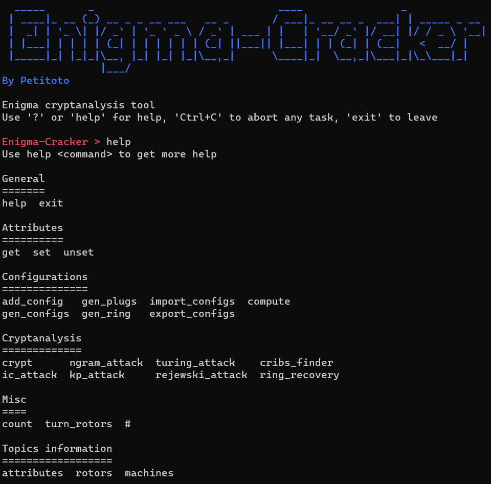

# Enigma-Cracker

[](https://www.python.org/)
[](https://www.pypy.org/)
[](/)
[](/)

Enigma-Cracker is a cryptanaylsis tool for the Enigma machine

## Functionnalities
Cryptanalysis:
- Crypt / decrypt messages
- Index of coincidence attacks
- N-grams attacks
- Known plaintext attack
- Turing's bombe
- Rejewski's attack
- Cribs finder using wordlists
- Ring settings recovery

Easy to use:
- Friendly CLI
- No external dependency
- Export / import configurations to save your work
- Misc commands to turn / roll back rotors, count letters...

Optimized:
- Use generators to reduce memory consumption
- Use multiprocessing to increase speed
- Compatible with PyPy to get incredibly fast results

Easy to extend:
- Customizable Enigma machines
- Add new attacks easily


## How to use
### Install
```
git clone https://github.com/Petitoto/Enigma-Cracker
cd Enigma-Cracker
python3 enigma-cracker.py
```

### Basic use
Use `help` or `help <command>` to get help

Global parameters are called `attributes`:
```
Enigma-Cracker > help attributes

        Attributes:
            text: text to encrypt, decrypt, or attack
            configs: Enigma configurations to encrypt, decrypt, or attack the text
            process: number of processes to launch attacks (default: 1)

        NB: multi processing prevents storing configurations as generators
```

Main principle:
- generate a lot of possible configurations
- attack configurations to filter them
- repeat until the correct configuration is the only one left

### Demo
#### Help


#### Index of coincidence to filter random configurations
[(doc/1-demo-ic.mp4)](https://user-images.githubusercontent.com/27863028/198119588-6fa437e2-b353-4c01-90da-3584b2b6fcc9.mp4)

#### Turing's bombe and crib to recover rotors configuration and partial plugboard settings
[(doc/2-demo-turing.mp4)](https://user-images.githubusercontent.com/27863028/198119597-28041dd3-d6fe-4499-8ef7-2895d73c8ec9.mp4)

#### Index of coincidence to recover more plugs
[(doc/3-demo-plugs.mp4)](https://user-images.githubusercontent.com/27863028/198119606-f887d0d1-1dad-4cb5-96c5-9815f7082813.mp4)

#### Recover ring settings
[(doc/4-demo](https://user-images.githubusercontent.com/27863028/198119614-450a2ac3-5778-48ec-8030-46ade41ffff3.mp4)
